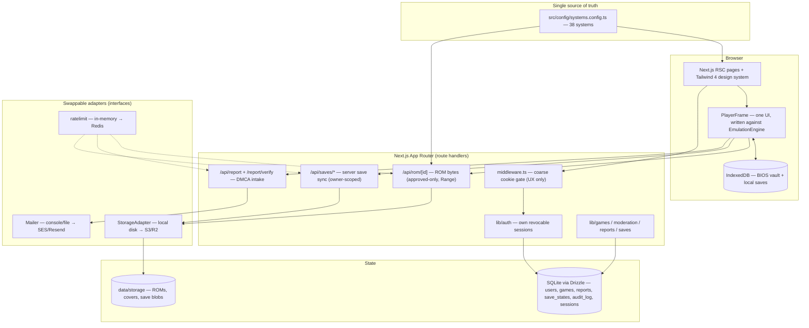

# RK8://

**Browser-native retro gaming platform.** Multi-engine (EmulatorJS + Ruffle +
js-dos), 38 systems, anonymous instant play, community uploads with moderation,
and a full DMCA compliance layer. Aesthetic: _Hermes Agent terminal minimalism ×
Cyberpunk 2077_.

> Non-commercial fan project — from one gamer to another. RK8 hosts only
> homebrew, public-domain, and openly-licensed games, and removes anything else
> on notice. See [Legal & compliance](#legal--compliance).

---

## Quick start

```bash
npm install            # also fetches engine runtimes (postinstall)
npm run setup:engines  # (re)provision EmulatorJS / Ruffle / js-dos into public/engines
npm run seed           # mount the legal starter library (idempotent)
npm run dev            # http://localhost:3000
```

The SQLite database auto-creates and self-heals on first import — there is no
separate migrate step for local dev. ROMs, covers, and synced saves live under
`data/` (git-ignored), never at guessable public paths.

**Sign in with zero OAuth setup** (dev only): set `DEV_AUTH=1` in `.env` and log
in with `admin@rk8.local` / `rk8admin`. This fallback is hard-disabled in
production builds. For real OAuth, register Discord/Google apps and fill the
credentials in `.env` (see [`.env.example`](.env.example)).

### The two green-checks before declaring done

```bash
npx tsc --noEmit       # types
npx next build         # production build
```

---

## Commands

| Command | What it does |
| --- | --- |
| `npm run dev` | Boot the app (DB auto-creates + self-heals). |
| `npm run build` / `npm start` | Production build / serve. |
| `npm run setup:engines` | Provision engine runtimes into `public/engines/` (never committed). |
| `npm run seed` | Mount the legal starter library; writes `SEED_LICENSES.md`. Idempotent. |
| `npm run db:push` | Push schema changes (Drizzle) — the dev schema-change workflow. |
| `npm run db:studio` | Drizzle Studio (DB browser). |
| `npm run lint` | Next/ESLint. |

---

## Architecture



### Invariants (do not break)

- **`src/config/systems.config.ts` is the single source of truth.** It drives
  nav, filters, upload validation, the BIOS manager, and engine routing. Adding
  a system is one entry here, then `npm run setup:engines` to fetch its core.
- **`EmulationEngine` interface** (`src/engines/types.ts`) with EJS / Ruffle /
  js-dos adapters. The player UI is written once against the interface;
  unsupported ops throw and are gated by `capabilities`.
- **`StorageAdapter`** (`src/lib/storage.ts`) — ROMs/covers/saves never sit at
  guessable paths. ROM bytes leave ONLY via `/api/rom/[id]` (approved-only,
  `Range`-capable).
- **Auth = our own revocable sessions** (`src/lib/auth/*`). OAuth (Discord/
  Google) → opaque token (SHA-256 stored) in the `sessions` table; ban/sign-out
  deletes the row = instant revocation. No JWTs, no auth SaaS.
- **Every mutation: Zod + rate limit.** Uploads also do an extension allowlist +
  magic-byte sniff (`src/lib/detect.ts`) + SHA dedupe. Every moderation action
  writes `audit_log`.

---

## Engine adapters

All three engines are self-hosted and version-pinned (`@ruffle-rs/ruffle`,
`js-dos` in `package.json`; EmulatorJS cores fetched by `setup:engines`). The
player never branches on engine type — it calls the interface:

```ts
// src/engines/types.ts (shape)
interface EmulationEngine {
  load(opts: LoadOpts): Promise<void>;
  saveState(): Promise<Uint8Array>;
  loadState(data: Uint8Array): Promise<void>;
  screenshot(): Promise<Blob>;
  setVolume(v: number): void;
  dispose(): void;
  readonly capabilities: EngineCapabilities; // saveStates, fastForward, ...
}
```

Adapters live in `src/engines/{ejs,ruffle,jsdos}.ts` and are constructed by
`createEngine(system.engine)`. Capabilities a given engine lacks (e.g. machine
save-states on Ruffle/js-dos) are reported `false`, and the UI greys out those
controls rather than calling them.

### Adding a system

1. Add one entry to `src/config/systems.config.ts` (id, name, manufacturer,
   `engine`, `core`, optional `bios`, `fallbackCore`, `heavy`/`experimental`
   flags, accepted file extensions + magic bytes for detection).
2. `npm run setup:engines` to fetch the EmulatorJS core (for `engine: "ejs"`).
3. Verify a known-good ROM boots, saves, and reloads in the player.

There is an `add-system` Claude skill (`.claude/skills/add-system`) that walks
this end to end.

---

## Storage — swapping the backend

`src/lib/storage.ts` defines `StorageAdapter`. v1 ships `LocalDiskStorage`
(zero ops; everything under `data/storage/`). To run at scale:

1. Implement the same interface over S3/R2 (`put`/`delete`/`exists`/`size`/
   `stream`/`streamUrl`).
2. Return a short-lived signed URL from `streamUrl()`. `/api/rom/[id]` will then
   302-redirect to it and app servers stop proxying ROM bytes.
3. No call sites change — the route handlers and the save-sync layer are written
   against the interface.

The same swap-point pattern applies to **`src/lib/mailer.ts`** (dev logs to the
console + `data/outbox/`; wire Resend/SES/Postmark for production — the DMCA
verification email depends on it) and **`src/lib/ratelimit.ts`** (in-memory
single-process; reimplement the same signature over Redis/Upstash at scale).

---

## Auth model

OAuth identities are linked by `(provider, sub)` and require a provider-verified
email; RK8 never auto-links into a privileged account by email. Sessions are
opaque tokens (only the SHA-256 is stored). Cookies are `httpOnly` +
`SameSite=Lax`, and `__Host-`/`Secure` in production. `getCurrentUser` /
`requireUser` / `requireRole` are authoritative; `middleware.ts` is a coarse
cookie-presence gate for UX only (it cannot hit the DB at the edge).

---

## Legal & compliance

### Moderation runbook

Everything a user uploads enters a **pending** queue and is private until a
moderator approves it. Moderators (`mod`) and admins (`admin`) work the queue at
`/admin`:

- **Approve** → game goes public (`approved`, stamps `publishedAt`).
- **Reject** (reason required) → `rejected`; stored bytes are deleted, the row
  kept as a record.
- **Takedown** (reason required) → `takedown` tombstone; stored bytes deleted.
- **Ban uploader** (admin only) → bans the account and revokes every live
  session immediately.
- **Restore** → re-publishes a taken-down game whose bytes were retained (see
  below). Surfaces in the `/admin` **Restorable** section.

Every action writes an `audit_log` row (actor, action, target, reason). The
audit tail is visible at the bottom of `/admin`.

### Reports & DMCA flow

- Every public game page has a **report** button → `/report/[id]`. Reporting is
  open to anonymous users (rights-holders should not have to register).
- Casual reports (broken / wrong info / other) are triaged by a moderator and
  never auto-act.
- **DMCA notices** require the sworn §512(c)(3) elements (contact email,
  signature, good-faith + penalty-of-perjury affirmation) and an **email
  round-trip verification** (`/report/verify`) before the 72-hour
  auto-unpublish clock is armed. This prevents anonymous, unverified notices
  from being used to mass-suspend the library.
- A verified, un-actioned DMCA notice auto-takes-down the listing within 72
  hours — but **reversibly**: the auto-takedown retains the stored bytes so a
  wrongful suspension can be restored. (A manual moderator takedown deletes
  bytes by design.)
- Policy pages: `/dmca` (full takedown policy, counter-notice, repeat-infringer
  three-strikes), `/legal`, `/contact`.

### ⚠️ Operator: designated agent (replace before launch)

The `/dmca` and `/contact` pages contain clearly-marked placeholder blocks for
the **designated copyright agent** and contact addresses. Before going live you
**must**:

1. Fill in the agent name, organization, mailing address, email, and phone on
   `/dmca` and `/contact` (search for `OPERATOR: REPLACE BEFORE LAUNCH`).
2. Register the designated agent with the U.S. Copyright Office at
   **dmca.copyright.gov** (required for §512 safe-harbor protection) and keep it
   current.
3. Set `APP_URL` and wire a real email transport in `src/lib/mailer.ts` so the
   DMCA verification link is actually delivered.
4. Set `TRUSTED_PROXY_HOPS` to match your deployment so anonymous rate limiting
   cannot be bypassed via spoofed `X-Forwarded-For`.

### BIOS policy

RK8 never bundles or proxies BIOS/firmware. Systems that need one prompt the
user to supply their own via the BIOS vault (`/bios`), stored only in the
browser's IndexedDB.

---

## Security posture

- Every mutation boundary validates with Zod and is rate-limited.
- Uploads: extension allowlist + magic-byte sniff + SHA-256 dedupe, validated
  before any bytes are written.
- ROMs serve only via `/api/rom/[id]` (approved-only, `Content-Disposition:
  inline`, sanitized filename, `Range` support); no directory listing, no
  `/storage` paths.
- Save blobs serve owner-scoped, `no-store`, behind the same storage adapter.
- The `security-audit` Claude skill runs the pre-ship checklist; the
  `rk8-security-reviewer` agent does adversarial review of auth / uploads /
  moderation / serving.

---

## Scaling posture

v1 is intentionally a single Node process with SQLite on local disk — correct
for launch, swappable without touching call sites:

| Concern | v1 | At scale |
| --- | --- | --- |
| Storage | local disk | S3/R2 + signed URLs (`StorageAdapter.streamUrl`) |
| Database | SQLite (better-sqlite3) | Postgres/Turso (Drizzle dialect change) |
| Rate limiting | in-memory map | Redis/Upstash (same `ratelimit` signature) |
| Email | console/file outbox | Resend/SES/Postmark (`Mailer`) |
| DMCA 72h sweep | lazy on play/admin reads | scheduled job; call sites become a backstop |
| Library reads | static/ISR | server-side pagination + search index |

---

## Project layout

```
src/
  app/            App Router pages + /api route handlers
  components/     player/, admin/, reports/, contribute/, chrome/, games/
  config/         systems.config.ts — THE source of truth
  engines/        EmulationEngine interface + ejs/ruffle/jsdos adapters
  lib/            auth/, storage, moderation, reports, saves, mailer, ratelimit, detect
  lib/client/     idb (BIOS + local saves), server-saves
  db/             schema.ts + bootstrap (index.ts)
scripts/          fetch-engines.mjs, seed.ts
public/engines/   provisioned runtimes (never committed)
data/             SQLite DB + storage + outbox (never committed)
```

---

## License

Code: see repository. Game content: each seeded title's license is documented in
`SEED_LICENSES.md`. Emulator runtimes retain their respective upstream licenses.
Trademarks belong to their owners.
